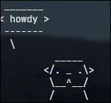
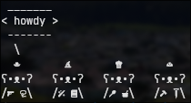

# Cowsay Otto
~~An otter for cowsay~~
An otter (or) multiple smaller otters, for cowsay

## Install
- run `sudo bash install.sh` in this directory
- common errors include
    - `cp: cannot create regular file '/usr/share/cowsay/cows/otto.cow': Permission denied`
        - Solution: run the script with sudo permissions
## Usage
- run `cowsay -f otto "text"`
- run `cowsay -f ottos "text"`
